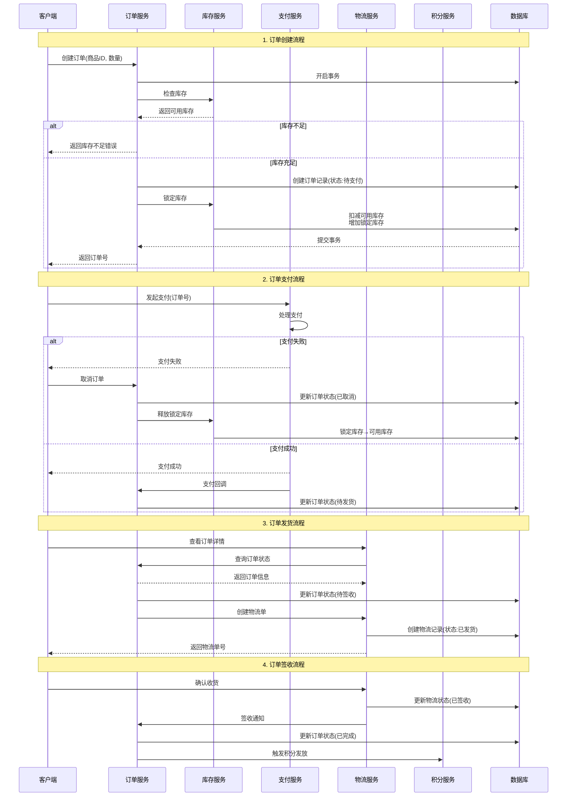
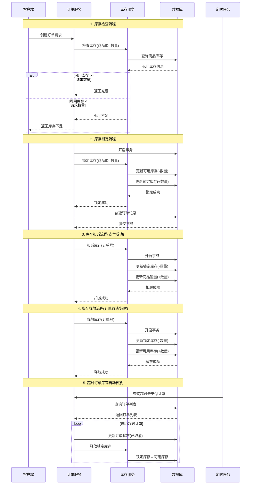
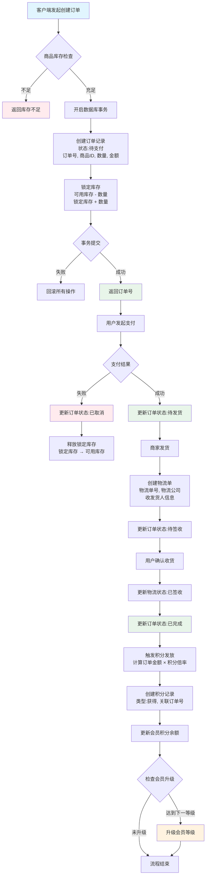
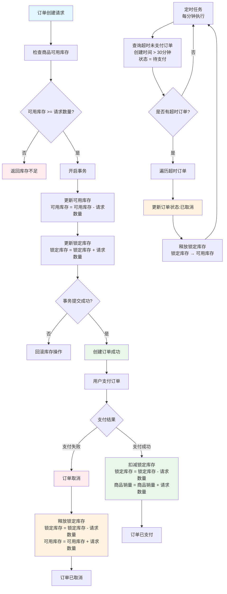
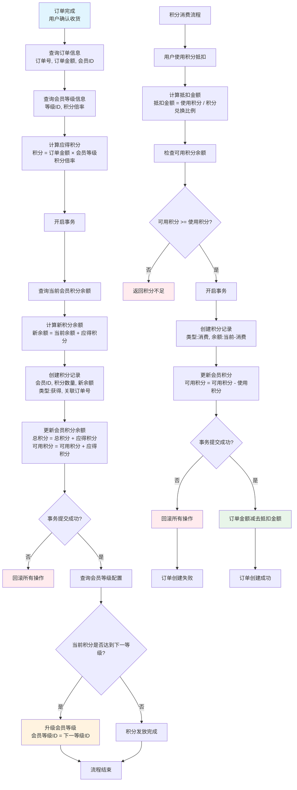
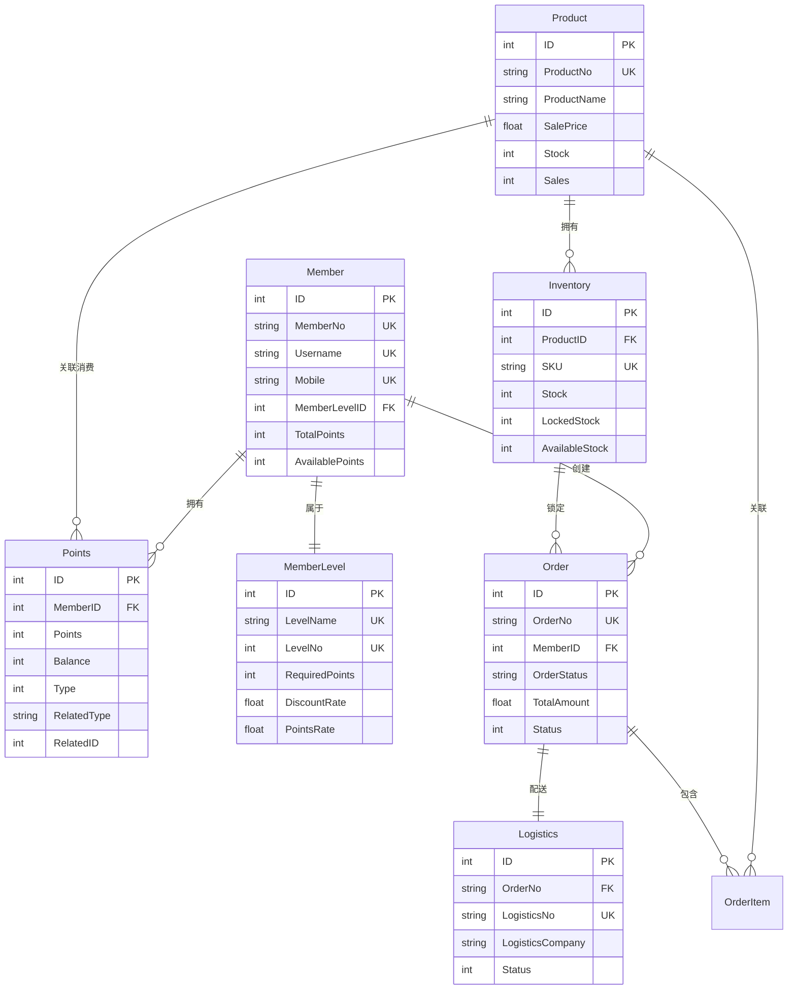

# 电商全流程设计文档

## 一、订单全流程时序图



## 二、库存全流程时序图



## 三、积分全流程时序图

```mermaid
sequenceDiagram
    participant Client as 客户端
    participant OrderService as 订单服务
    member MemberService as 会员服务
    participant PointsService as 积分服务
    participant DB as 数据库

    Note over Client,DB: 1. 订单完成触发积分流程
    Client->>OrderService: 确认收货
    OrderService->>DB: 更新订单状态(已完成)
    OrderService->>PointsService: 计算并发放积分(订单号)

    PointsService->>DB: 查询订单信息
    DB-->>PointsService: 返回订单详情
    PointsService->>DB: 查询会员信息
    DB-->>PointsService: 返回会员等级

    PointsService->>PointsService: 计算积分<br/>积分 = 订单金额 * 会员等级积分倍率

    PointsService->>DB: 开启事务
    PointsService->>DB: 插入积分记录<br/>(类型:获得, 余额:当前+新增)
    PointsService->>MemberService: 更新会员总积分
    MemberService->>DB: 更新会员积分余额
    DB-->>PointsService: 提交事务

    PointsService->>PointsService: 检查会员升级
    alt 积分达到下一等级
        PointsService->>DB: 查询下一等级配置
        DB-->>PointsService: 返回等级信息
        PointsService->>MemberService: 升级会员等级
        MemberService->>DB: 更新会员等级ID
    end

    PointsService-->>Client: 返回积分发放结果
```

## 四、订单数据流程图



## 五、库存数据流程图



## 六、积分数据流程图



## 七、数据库表关系说明

### 核心表关联关系



## 八、关键业务规则

### 8.1 订单业务规则

1. **订单号生成规则**: 采用雪花算法，保证全局唯一
2. **订单状态流转**:
   - 待支付 (0) → 待发货 (1) → 待签收 (2) → 已完成 (3)
   - 待支付 (0) → 已取消 (4)
3. **订单超时自动取消**: 下单后30分钟未支付自动取消
4. **订单取消条件**: 仅待支付状态的订单可取消

### 8.2 库存业务规则

1. **库存预扣机制**: 下单时先锁定库存，支付成功后扣减
2. **库存释放机制**: 订单取消或超时未支付自动释放锁定库存
3. **库存预警**: 可用库存低于预警值时触发告警
4. **库存防超卖**: 使用数据库行级锁保证库存扣减原子性

### 8.3 积分业务规则

1. **积分发放时机**: 订单完成后发放
2. **积分计算公式**: `积分 = 订单金额 × 会员等级积分倍率`
3. **积分过期规则**: 积分有效期为1年，过期自动失效
4. **会员升级规则**: 积分达到下一等级要求时自动升级
5. **积分抵扣规则**: 100积分 = 1元，可抵扣订单金额

### 8.4 物流业务规则

1. **物流单号生成**: 采用雪花算法 + 物流公司前缀
2. **物流状态流转**:
   - 待发货 (1) → 已发货 (2) → 运输中 (3) → 已签收 (4)
   - 已发货 (2) → 已拒收 (5)
   - 待发货 (1) → 已取消 (6)
3. **物流时效要求**: 下单后24小时内发货

## 九、事务一致性保证

### 9.1 订单创建与库存锁定

```go
// 伪代码示例
func CreateOrder(req *CreateOrderReq) error {
    return db.Transaction(func(tx *gorm.DB) error {
        // 1. 检查库存（使用悲观锁）
        var inventory Inventory
        err := tx.Clauses(clause.Locking{Strength: "UPDATE"}).
            Where("product_id = ? AND available_stock >= ?", req.ProductID, req.Quantity).
            First(&inventory).Error
        if err != nil {
            return err // 库存不足
        }

        // 2. 锁定库存
        err = tx.Model(&inventory).
            Updates(map[string]interface{}{
                "available_stock": gorm.Expr("available_stock - ?", req.Quantity),
                "locked_stock":    gorm.Expr("locked_stock + ?", req.Quantity),
            }).Error
        if err != nil {
            return err
        }

        // 3. 创建订单
        order := &Order{
            OrderNo:     generateOrderNo(),
            ProductID:   req.ProductID,
            Quantity:    req.Quantity,
            TotalAmount: req.Price * float64(req.Quantity),
            Status:      OrderStatusPendingPay,
        }
        err = tx.Create(order).Error
        if err != nil {
            return err
        }

        return nil
    })
}
```

### 9.2 订单支付与库存扣减

```go
func PayOrder(orderNo string) error {
    return db.Transaction(func(tx *gorm.DB) error {
        // 1. 更新订单状态
        err := tx.Model(&Order{}).
            Where("order_no = ? AND status = ?", orderNo, OrderStatusPendingPay).
            Update("status", OrderStatusPendingShip).Error
        if err != nil {
            return err
        }

        // 2. 获取订单信息
        var order Order
        err = tx.Where("order_no = ?", orderNo).First(&order).Error
        if err != nil {
            return err
        }

        // 3. 扣减锁定库存
        err = tx.Model(&Inventory{}).
            Where("product_id = ?", order.ProductID).
            Updates(map[string]interface{}{
                "locked_stock": gorm.Expr("locked_stock - ?", order.Quantity),
            }).Error
        if err != nil {
            return err
        }

        // 4. 增加商品销量
        err = tx.Model(&Product{}).
            Where("id = ?", order.ProductID).
            Update("sales", gorm.Expr("sales + ?", order.Quantity)).Error
        if err != nil {
            return err
        }

        return nil
    })
}
```

### 9.3 订单取消与库存释放

```go
func CancelOrder(orderNo string) error {
    return db.Transaction(func(tx *gorm.DB) error {
        // 1. 获取订单信息
        var order Order
        err := tx.Where("order_no = ?", orderNo).First(&order).Error
        if err != nil {
            return err
        }

        // 2. 更新订单状态
        err = tx.Model(&Order{}).
            Where("order_no = ?", orderNo).
            Update("status", OrderStatusCancelled).Error
        if err != nil {
            return err
        }

        // 3. 释放锁定库存
        err = tx.Model(&Inventory{}).
            Where("product_id = ?", order.ProductID).
            Updates(map[string]interface{}{
                "locked_stock":    gorm.Expr("locked_stock - ?", order.Quantity),
                "available_stock": gorm.Expr("available_stock + ?", order.Quantity),
            }).Error
        if err != nil {
            return err
        }

        return nil
    })
}
```

## 十、异常处理与补偿机制

### 10.1 库存异常处理

1. **库存不足**: 返回明确错误，提示用户
2. **库存锁定失败**: 回滚订单创建，释放资源
3. **库存释放失败**: 记录异常日志，人工介入处理

### 10.2 支付异常处理

1. **支付超时**: 订单自动取消，释放锁定库存
2. **支付失败**: 订单状态保持待支付，用户可重试
3. **支付回调重复幂等**: 使用唯一订单号+支付流水号保证幂等性

### 10.3 积分异常处理

1. **积分发放失败**: 记录失败日志，支持手动补发
2. **会员升级失败**: 记录异常，不影响积分发放
3. **积分重复发放**: 使用订单号+会员ID作为幂等键

## 十一、性能优化建议

1. **数据库优化**:
   - 为高频查询字段添加索引（order_no, member_id, product_id等）
   - 读写分离，查询操作走从库
   - 分库分表，按会员ID或订单号分片

2. **缓存策略**:
   - 商品库存信息缓存到Redis，设置过期时间
   - 会员等级信息缓存，减少数据库查询
   - 使用Redis分布式锁防止超卖

3. **异步处理**:
   - 积分发放、会员升级异步处理
   - 物流信息更新异步处理
   - 使用消息队列解耦服务

4. **定时任务**:
   - 超时订单自动取消（每分钟执行）
   - 积分过期处理（每日执行）
   - 库存预警检查（每小时执行）