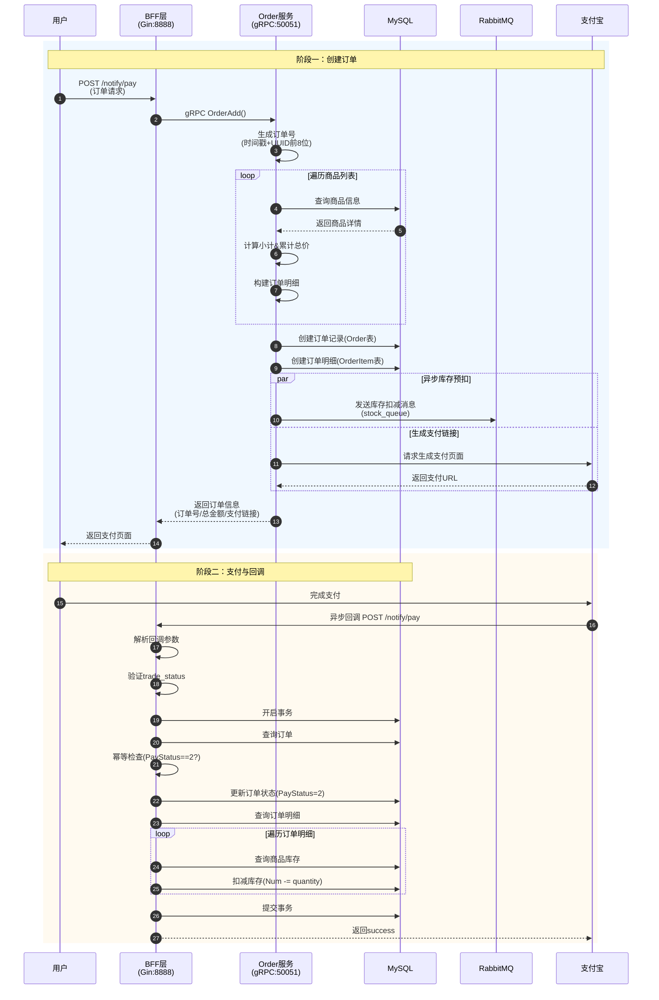
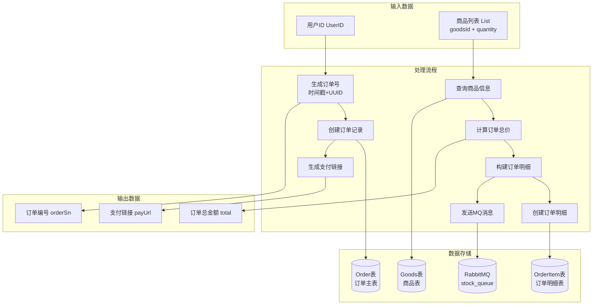
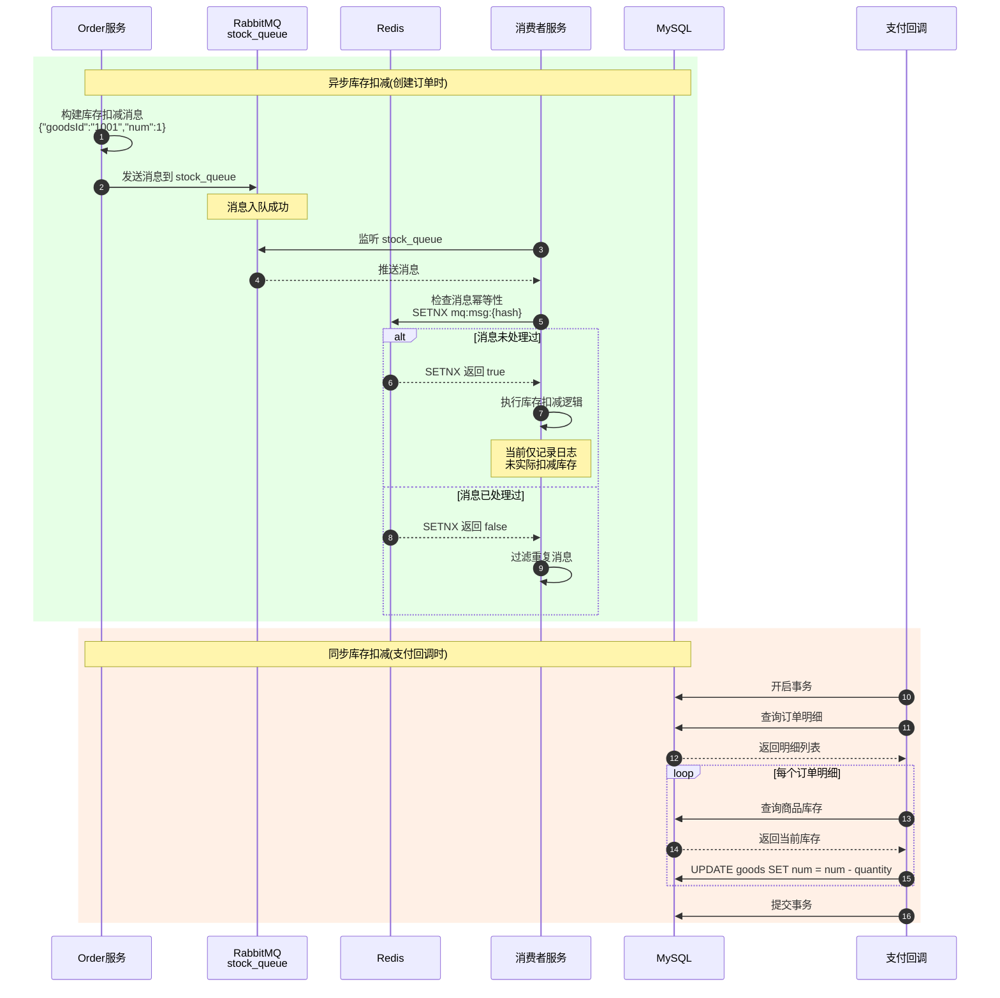
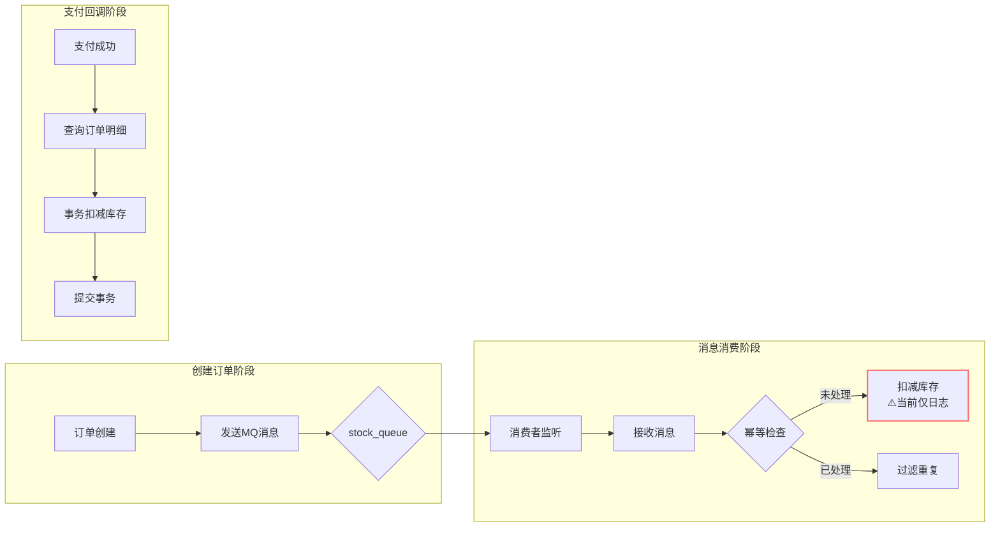
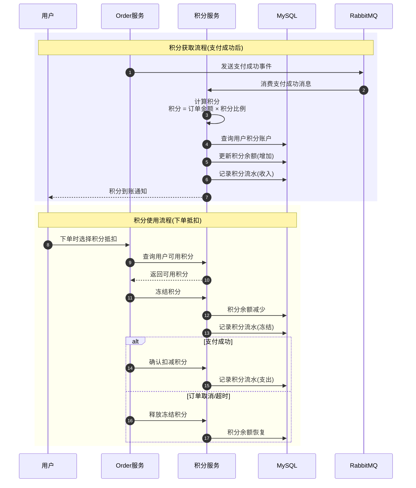
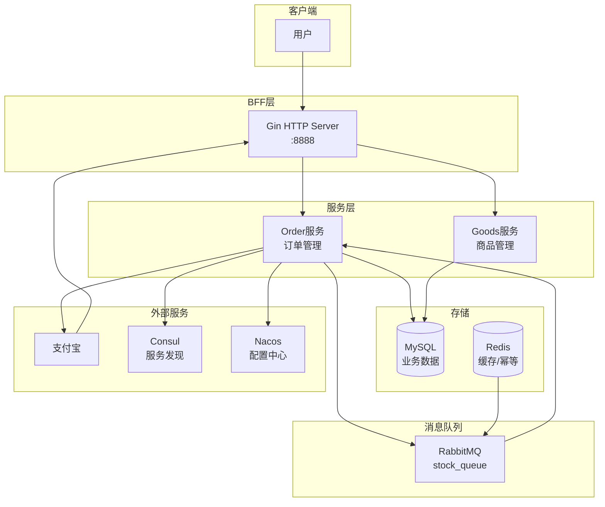

# 业务流程分析文档

## 一、订单全流程

### 1.1 订单流程时序图



### 1.2 订单数据流程图



### 1.3 订单数据模型

| 字段 | 类型 | 说明 |
|------|------|------|
| **Order (订单主表)** |||
| ID | uint | 主键，自增 |
| OrderNo | varchar(32) | 订单编号，唯一 |
| UserID | int | 用户ID |
| TotalPrice | decimal(10,2) | 订单总金额 |
| PayStatus | int | 支付状态：0未支付，1已支付(实际用2) |
| **OrderItem (订单明细表)** |||
| ID | uint | 主键 |
| OrderNo | varchar(32) | 订单编号，索引 |
| GoodsID | uint | 商品ID |
| GoodsName | varchar(50) | 商品名称(快照) |
| GoodsPrice | decimal(10,2) | 商品单价(快照) |
| Num | int | 购买数量 |

---

## 二、库存全流程

### 2.1 库存流程时序图



### 2.2 库存数据流程图



### 2.3 ⚠️ 库存流程问题分析

**问题一：异步与同步库存扣减冲突**

| 阶段 | 操作 | 实际效果 |
|------|------|----------|
| 创建订单 | 发送MQ消息 | 消费者仅打印日志，未扣减 |
| 支付回调 | 事务扣减库存 | ✅ 实际扣减库存 |

**问题二：消费者未实现实际扣减**

```go
// 当前代码：仅打印日志
func ConsumeStockDeduct() {
    SubscribeMsg("stock_queue", func(msg string) {
        log.Println("执行库存扣减，消息：", msg)
        log.Println("库存扣减日志已记录")  // 未实际操作数据库
    })
}
```

**问题三：未支付订单的库存占用**

- 创建订单时不扣减库存 → 可能超卖
- 建议：创建订单时预扣库存，支付成功确认，超时未支付则释放

---

## 三、积分全流程

### 3.1 当前状态：❌ 未实现

经代码分析，当前代码库中**未找到积分相关业务实现**。

### 3.2 建议的积分流程设计



### 3.3 建议的积分数据模型

```sql
-- 积分账户表
CREATE TABLE points_account (
    id BIGINT PRIMARY KEY AUTO_INCREMENT,
    user_id INT NOT NULL COMMENT '用户ID',
    total_points INT DEFAULT 0 COMMENT '总积分',
    available_points INT DEFAULT 0 COMMENT '可用积分',
    frozen_points INT DEFAULT 0 COMMENT '冻结积分',
    created_at TIMESTAMP DEFAULT CURRENT_TIMESTAMP,
    updated_at TIMESTAMP DEFAULT CURRENT_TIMESTAMP ON UPDATE CURRENT_TIMESTAMP,
    UNIQUE KEY uk_user_id (user_id)
) COMMENT='积分账户表';

-- 积分流水表
CREATE TABLE points_log (
    id BIGINT PRIMARY KEY AUTO_INCREMENT,
    user_id INT NOT NULL COMMENT '用户ID',
    points INT NOT NULL COMMENT '积分变动数量(正数收入,负数支出)',
    type TINYINT NOT NULL COMMENT '类型:1收入 2支出 3冻结 4解冻',
    source VARCHAR(50) COMMENT '来源:订单支付/积分抵扣/系统赠送',
    order_no VARCHAR(32) COMMENT '关联订单号',
    balance_after INT COMMENT '变动后余额',
    remark VARCHAR(200) COMMENT '备注',
    created_at TIMESTAMP DEFAULT CURRENT_TIMESTAMP,
    KEY idx_user_id (user_id),
    KEY idx_order_no (order_no)
) COMMENT='积分流水表';
```

---

## 四、整体业务架构图



---

## 五、流程总结

| 流程 | 状态 | 说明 |
|------|------|------|
| 订单创建 | ✅ 已实现 | 完整实现订单创建、明细记录 |
| 订单支付 | ✅ 已实现 | 支付宝支付、回调处理 |
| 库存扣减 | ⚠️ 部分实现 | 仅支付回调时同步扣减，MQ消费者未实现 |
| 积分获取 | ❌ 未实现 | 需新增积分服务 |
| 积分使用 | ❌ 未实现 | 需新增积分服务 |